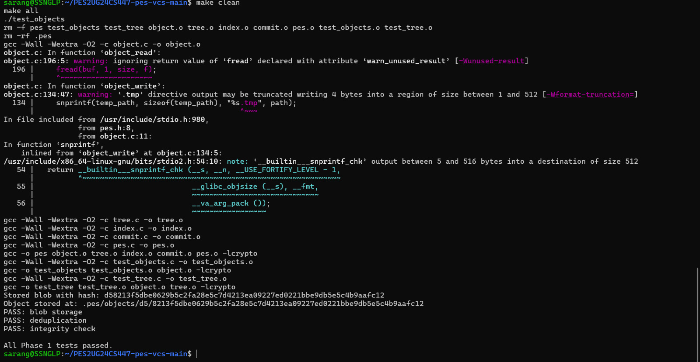
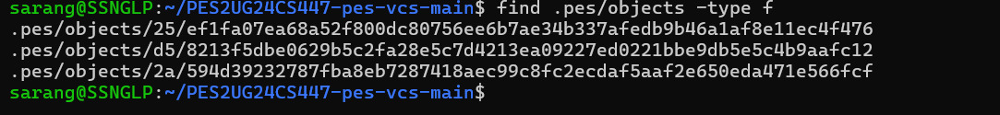
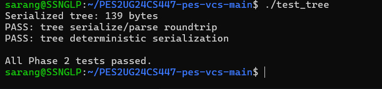
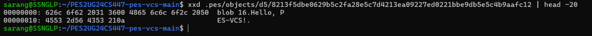
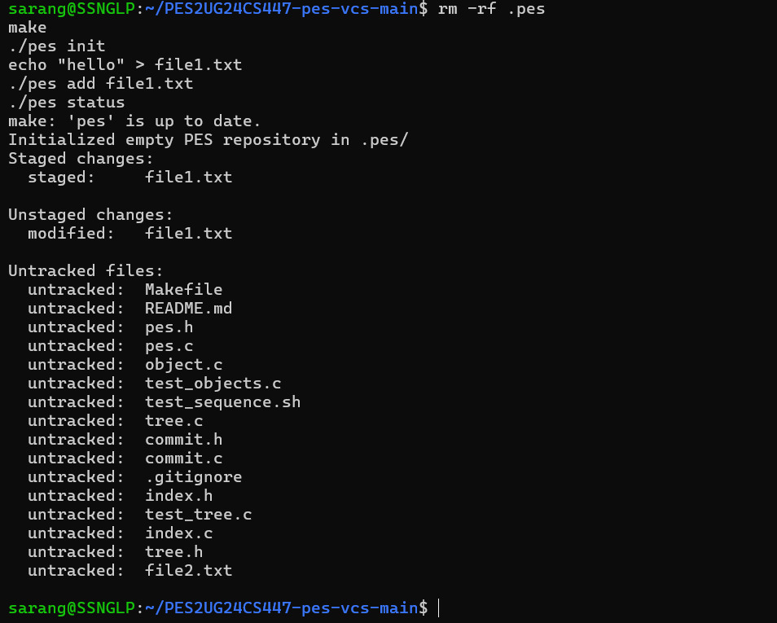
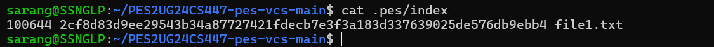
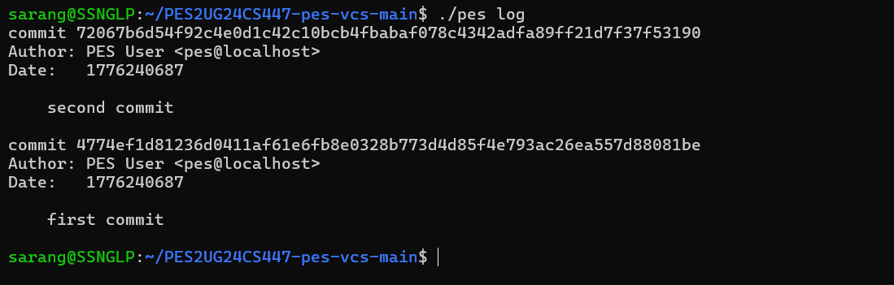
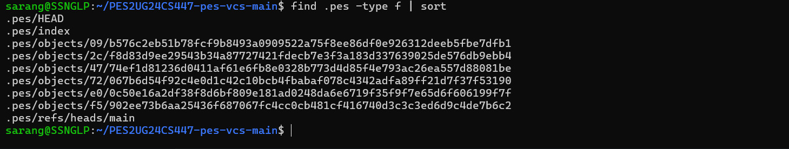
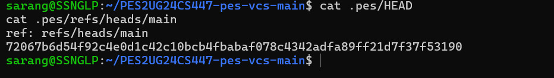

# PES Version Control System (PES-VCS) Lab Report

## Overview

This project implements a simplified version control system similar to Git. It supports:

* Content-addressable object storage
* Tree-based directory structure
* Staging area (index)
* Commit creation and history tracking
* Log traversal

---

## Phase 1: Object Storage

### Description

In this phase, we implemented a content-addressable object store using SHA-256 hashing. Each object is stored based on its hash in `.pes/objects`.

---

### Screenshot 1A: Test Objects Output

---

### Screenshot 1B: Object Directory Structure

---

##  Phase 2: Tree Objects

### Description

Tree objects represent directory structures. Each tree contains entries mapping filenames to object hashes.

---

### Screenshot 2A: Tree Test Output

---

### Screenshot 2B: Raw Tree Object (xxd)

---

## Phase 3: Index (Staging Area)

### Description

The index acts as a staging area, tracking files before committing. It stores file metadata and hashes.

---

### Screenshot 3A: pes init → add → status

---

### Screenshot 3B: Index File Contents

---

## Phase 4: Commits & History

### Description

Commits capture snapshots of the project. Each commit stores:

* Tree reference
* Parent commit
* Author and timestamp
* Commit message

---

### Screenshot 4A: Commit Log

---

### Screenshot 4B: Object Growth

---

### Screenshot 4C: HEAD and Branch Reference

---

## Analysis Questions

### Q5.1: A branch in Git is just a file in `.git/refs/heads/` containing a commit hash. Creating a branch is creating a file. Given this, how would you implement `pes checkout <branch>` — what files need to change in `.pes/`, and what must happen to the working directory? What makes this operation complex?

A branch in Git is simply a reference file that stores a commit hash, so implementing pes checkout `<branch>` involves updating both internal references and the working directory. First, the .pes/HEAD file must be updated to point to the new branch (e.g., `ref: refs/heads/<branch>`), and the corresponding branch file in `.pes/refs/heads/` must be read to obtain the commit hash. Then, the system must load that commit, retrieve its associated tree, and reconstruct the working directory by writing all files from the tree (via blob objects) and removing any files that are not present in the target branch. The .pes/index must also be updated to match the new commit’s state. This operation is complex because it must handle uncommitted changes that could be overwritten, resolve potential file conflicts, correctly rebuild directory structures, and ensure that the HEAD, index, and working directory remain consistent throughout the process.

---

### Q5.2: When switching branches, the working directory must be updated to match the target branch's tree. If the user has uncommitted changes to a tracked file, and that file differs between branches, checkout must refuse. Describe how you would detect this "dirty working directory" conflict using only the index and the object store.

To detect a “dirty working directory” conflict during pes checkout, we can compare the current working directory against the index and the target branch’s tree using the object store. For each file tracked in the index, we first recompute its hash from the working directory and compare it with the stored hash in the index; if they differ, the file has uncommitted changes. Next, we load the target branch’s commit and its tree, and check whether the same file exists there with a different hash than in the current index. If both conditions are true—(1) the file is modified in the working directory compared to the index, and (2) the file differs between the current index and the target branch’s tree—then a conflict exists, and checkout must refuse to proceed. This approach relies only on hashing and comparisons with stored object hashes, without needing additional metadata.

---

### Q5.3: "Detached HEAD" means HEAD contains a commit hash directly instead of a branch reference. What happens if you make commits in this state? How could a user recover those commits?

In a detached HEAD state, HEAD points directly to a specific commit instead of a branch, so any new commits made will not belong to any branch. These commits are still created and stored in the object database, but since no branch reference points to them, they become “dangling” and can be lost once they are no longer reachable. To recover such commits, the user can create a new branch pointing to the current commit (e.g., by updating a file in .pes/refs/heads/ to the commit hash), thereby attaching the detached commits to a branch and making them part of the normal history.

---

### Q6.1: Over time, the object store accumulates unreachable objects — blobs, trees, or commits that no branch points to (directly or transitively). Describe an algorithm to find and delete these objects. What data structure would you use to track "reachable" hashes efficiently? For a repository with 100,000 commits and 50 branches, estimate how many objects you'd need to visit.

Garbage collection removes objects that are no longer reachable from any commit or reference, freeing storage

---

### Q6.2: Why is it dangerous to run garbage collection concurrently with a commit operation? Describe a race condition where GC could delete an object that a concurrent commit is about to reference. How does Git's real GC avoid this?

To perform garbage collection, we first identify all reachable objects by starting from every branch reference in .pes/refs/heads/ and traversing the commit graph. For each branch, we follow its commit hash, then recursively visit its parent commits and associated tree objects, and from each tree, traverse all referenced blobs and subtrees. During this traversal, we store every visited hash in a hash set (or hash table), which allows efficient O(1) lookup to mark objects as reachable. After this marking phase, we scan the entire .pes/objects/ directory and delete any object whose hash is not present in the reachable set, as these are unreachable (garbage). For a repository with 100,000 commits and 50 branches, although there are 50 starting points, many commits are shared across branches, so the traversal will typically visit on the order of ~100,000 commits plus their associated trees and blobs, rather than 50×100,000. Including trees and blobs, the total number of visited objects may be a few times larger, but still linear in the size of the repository, making the algorithm efficient.

---

## Conclusion

This project demonstrates the core principles of version control systems:

* Efficient storage using hashing
* Snapshot-based commits
* Branching through references
* History traversal

The implementation successfully mimics key Git functionalities in a simplified manner.

---
